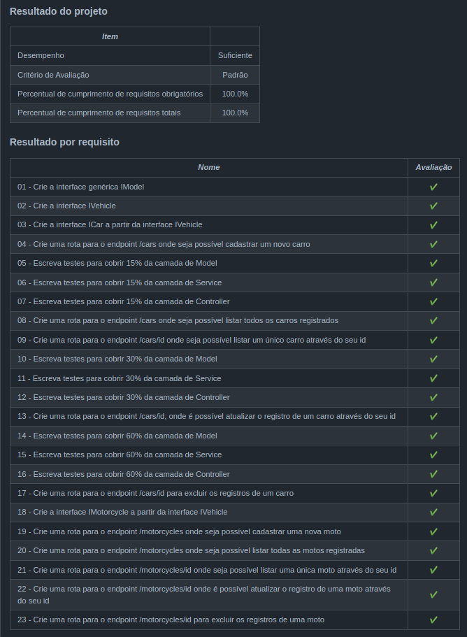

<h1>Sobre</h1>

Décimo segundo projeto do módulo 3 - Back-end, da <a href="https://betrybe.com" target="_blank">Trybe!</a>

Dessa vez foi o projeto Car Shop. O desafio foi aplicar os princípios de Programação Orientada a Objetos (POO) para a construção de uma API com CRUD para gerenciar uma concessionária de veículos. Isso foi feito utilizando o banco de dados MongoDB, usando o ODM Mongoose.

<h1>Instalando</h1>

Para instalar, basta executar o comando <code>npm install</code> no diretório raiz do projeto.

Logo depois, rode o comando <code>docker-compose up -d</code>, também, no diretório raiz do projeto. 

Logo após, rode o comando <code>docker exec -it car_shop bash</code> para acessar o container. 

Por fim, execute o comando <code>npm run dev</code> dentro do container.

<h1>Tecnologias utilizadas</h1>

<ul>
  <li>Node.js</li>
  <li>TypeScript</li>
  <li>MongoDB</li>
  <li>Mongoose</li>
  <li>Express</li>
  <li>Docker</li>
  <li>POO</li>
  <li>SOLID</li>
</ul>
 
<h1>Nota</h1>

 